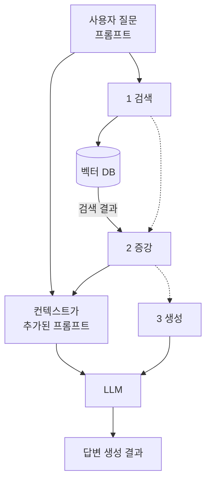

# 2.1 RAG 시스템이란?

## LLM 최대의 약점, 환각 현상

- 트랜스포머 Decoder 모듈이 여러 개 결합된 모델
- 텍스트를 생성하는 기능에 특화되어있다.
- 거짓을 사실인 양 자연스럽게 답변하여 거짓 정보를 내 뱉음

WHY?

> 잘못된 맥락이 주어진 경우, 학습 이후의 사실에 대해 질문할 경우, 단정적인 질문을 할 경우

## 컨텍스트 윈도우 제한 문제

> 컨텍스트 윈도우?
> 입력으로 주어진 텍스트 값의 길이

- 입력값 길이의 상한선이 존재
- LLM은 주어진 텍스트를 이해하기 위해 행렬 연산을 수행하고, 입력값이 길어지면 이에 따라 계산량이 O(n^2)만큼 기하급수적으로 늘어나게 됩니다.

| 기업     | 모델           | 컨텍스트 윈도우 제한(토큰 수) |
| -------- | -------------- | ----------------------------- |
| 오픈AI   | GPT-4o         | 128,000                       |
| 오픈AI   | GPT-3.5 Turbo  | 16,385                        |
| 앤트로픽 | Claude 2.1     | 200,000                       |
| 구글     | Gemini 1.5 Pro | 10,000,000                    |

## LLM API의 기억상실증 문제

ChatGPT와 다르게 이전 대화를 기억하지 못합니다.
문제라기 보단 LLM은 주어진 질문에 대한 답변을 하기 때문에 당연함.

> chat completion, assistant

## 환각 현상을 극복한 RAG의 등장

> RAG 검색 증강 생성 기법
> 검색 - 증강 - 생성 3단계를 통해서 LLM이 사실에 근거한 답변을 하도록 만듭니다.



- 질문에 답변하기 위해 LLM에만 의존하는 것이 아니라 외부 지식을 참고하도록 만든다.
- 사용자 질문을 받으면 유사한 정보를 벡터 DB에서 검색, 사용자 질문과 검색된 유사 정보를 하나의 프롬프트로 담아 LLM에게 전달하여 올바른 답변을 생성합니다.

### 1. 검색 Retrieval

'어떻게 사용자 질문에 올바른 정보를 찾아오는가?'

- 임베딩 값의 유사도를 이용

**검색 순서**

1. 사용자 질문을 행렬값(임베딩) 으로 변환 (BERT 같은 모델 활용)
2. 참고할 문서들을 동일한 방식으로 행렬값으로 변환 (=벡터 DB)
3. 벡터 DB에서 사용자 질문 임베딩과 가장 유사한 임베딩을 추출

4. 임베딩 모델
5. 검색하여 가져올 문장의 형태

문장의 경우 Sentense-BERT를 활용하게 되는데, 학습시킨 언어에 대해서만 임베딩 작업을 잘 수행함

- 영어 데이터를 학습시킨 Sentence-BERT의 경우, 한글 임베딩 성능이 떨어진다.
- 만일 질문이 한글, 벡터 DB도 한글이라면 오픈소스 모델 중 다국어 (Multilingual) 모델이나 한국어 모델을 활용한는 것이 좋다.

> 굉장힌 긴 문장의 글을 벡터 DB를 통해 하나의 임베딩 값으로 변환할 수 있을까요?
> NO. 컨텍스트 윈도우 개념이 존재하며 제한된 값을 가짐
> 최대 입력 길이를 벗어날 경우 분할하는 과정을 거침 (=Chunking 조각내기)

유사한 임베딩 값을 찾아냈다고 하더라도 찾은 문서 청크에 사용자 질문에 답변할 수 있는 맥락이 담기지 않을 수 있기 때문.

따라서 어떤 방식으로/ 어떤 구조로 문서를 분할하여 저장할지 고민해야함.

| 오픈 소스 여부 | 기업                      | 모델                    | 최대 입력 길이(토큰) |
| -------------- | ------------------------- | ----------------------- | -------------------- |
| Closed source  | 오픈AI                    | text-embedding-3-small  | 8,191                |
| Closed source  | 오픈AI                    | text-embedding-3-large  | 8,191                |
| Closed source  | 오픈AI                    | text-embedding-ada-002  | 8,191                |
| Closed source  | Cohere                    | embed-english-v3.0      | 512                  |
| Closed source  | Cohere                    | embed-multilingual-v3.0 | 512                  |
| Closed source  | Mistral                   | SFR-Embedding-Mistral   | 32,769               |
| Open source    | Voyage AI                 | voyage-lite-02-instruct | 4,000                |
| Open source    | MS, Contextual AI, 홍콩대 | GritLM-7B               | 32,768               |

### 2. 증강 Augment

검색 단계에서 추출한 유사 청크를 하나의 프롬프트에 담아 LLM에게 전달하는 과정.

RAG 프레임워크는 랭체인에서 제공하는 RAG 전용 프롬프트

```
답변 방식 설명
You are an assistant for question-answering tasks.
Use the following pieces of retrieved context to answer the question.
If you don't know the answer, just say that you don't know.
Use three sentences maximum and keep the answer concise.
사용자 질문
-- Question: {question}
유사 청크
-- Context: {context}
Answer:
```

1. 답변하는 방식 설명

- 주어진 맥락을 참고하여 답변하라
- 모르겠으면 모르겠다고 답하라
- 위 두가지 프롬프트는 항상 포함하는 편이 좋음

2. 사용자 질문

- {question} 이라는 매개변수에 사용자가 질문한 문장이 그대로 들어감

3. 검색 단계에서 추출한 유사 청크 {context}
4. 'Answer :' 사용자 질문에 대한 답변만 출력하도록 만듬

### 3. 생성 Generation

LLM은 주어진 문장의 다음 단어를 예측하는 모델이기 때문에 주어진 질문에 답하려는 습성을 갖고있다.
따라서 RAG를 통해 맥락을 주입하면 학습되지 않은 사실이나 지식에 대해 알맞은 답변을 제공할 수 있다.

# 2.2 RAG vs 파인튜닝

파인튜닝: 모델 미세조정

LLM이 사전 학습 과정에서 습득한 지식 외의 데이터셋을 기반으로 재조정하여 새로운 지식 및 답변 방식을 훈련시키는 것.

- Bloomberg-GPT : 금융 분야 데이터셋 기반으로 LLM을 파인튜닝

특정 도메인에 특화된 LLM을 만들 수 있다.

### 1. 난이도

> RAG가 파인튜닝보다 구축하기 쉬움

RAG : 별도 개발 필요없이 누구나 쉽게 구축 가능
파인튜닝 : 아키텍처를 변한하거나 최신 모델과 병합 처리 해야하므로 LLM 활용 역량이 필요함

### 2. 시간

> RAG가 파인튜닝보다 시간이 덜 걸린다.

- 임베딩을 제외하면 계산할 요소가 적어 빠르게 구축할 수 있다.
- 파인튜닝의 경우는 '학습 데이터셋 구축' 과 '모델 파인튜닝' 작업을 수행해야하며, 특히 파인튜닝은 LLM 자체의 가중치를 새롭게 업데이트 하기 때문에 계산량이 매우 많다. Full-파인튜닝은 고사양 GPU를 이용하고 많은 시간이 소요되며, PEFT와 같은 레이어 파인튜닝은 Full-파인튜닝에 비해 시간이 적게 걸리긴하지만 RAG에 비해 많은 시간이 소요됨.
- 새로운 지식을 추가할때
  - RAG는 벡터 DB를 추가하기만 하면 됨
  - 파인튜닝은 기존 모델에서 새로운 데이터셋으로 재학습해야하기 때문에 많은 시간이 소요됨.

### 3. 비용

> RAG가 파인튜닝에 비해 비용적으로 적게 든다.

- RAG : 임베딩만 하면 됨
- 파인튜닝 : 고사양 GPU, 기술 구현의 높은 난이도, '질문-답' 형태의 데이터셋 구성 필요

### 4. 성능

> RAG와 파인튜닝의 무승부

- RAG: 주어진 자료를 얼마나 잘 임베딩시키고, 유사 청크를 얼마나 검색 및 추출하는지에 따라 성능이 결정됨.
- 파인튜닝: 데이터셋의 품질과 적용 방법론에 따라 성능이 달라짐.

그런데 오픈 소스 LLM으로 비교 영역을 한정하면 이야기가 달라집니다.
만약 오픈 소스 LLM을 기반으로 각자를 구현한다면, 파인튜닝의 성능이 항상 가능성이 더 큽니다.
RAG는 모델의 성능이 고정되어 있기 때문에, 모델 외의 모듈들을 최적화하여 성능을 올릴 수밖에 없습니다.
그러나 파인튜닝의 경우, 오픈 소스 LLM을 특정 도메인 데이터셋으로 특화하여 재학습시키기 때문에, 답변 품질이 항상 높을 수 있습니다.
물론 이 모델을 RAG에 활용하여 'RAG+파인튜닝' 방식의 결합 형태를 만들 수 있고 이 경우의 성능이 더욱 좋습니다.

| 기준          | RAG                                              | 파인튜닝              |
| ------------- | ------------------------------------------------ | --------------------- |
| 비용          | 저가                                             | 고가                  |
| 시간          | 단기간 구축 가능                                 | 학습 위해 장기간 소요 |
| 난이도        | 쉬움                                             | 어려움                |
| 필수 하드웨어 | 임베딩 모델과 LLM 구축 위한 높은 VRAM을 가진 GPU |

### 정리

- 빠른 시일 내에 PoC 구축하여 서비스 결합 가능성을 검토
- 지식 업데이트 주기가 잦은 경우
  => RAG가 유리

오픈소스 LLM으로만 서비스를 운영할 계획이고 시간과 비용이 충분
=> 파인튜닝
